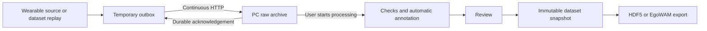

# CapEgo

**From first-person capture to traceable training data.**

[English](README.md) · [简体中文](README.zh-CN.md)

[](https://github.com/Auromix/capego/actions/workflows/tests.yml)
[](LICENSE)
[](pyproject.toml)

CapEgo is an open-source **egocentric data collection and dataset toolkit** for developers working with human-hand activity and world action models (WAMs). Stream recordings to a PC, run local post-processing when you choose, review annotations, and export versioned datasets with their provenance intact.

**Status: working software prototype.** Real public EgoDex clips have passed the HTTP capture pipeline and the unmodified EgoWAM Human loader, then participated in a small world/action training run. Wearable hardware and production capture performance remain under development. [Read the evidence and limits →](design/validation/2026-09-24-real-data.md)

## Why CapEgo?

- **Continuous capture:** send while recording; release temporary device buffers only after durable PC acknowledgements. Recover interrupted transfers without restarting the recording.
- **Local control:** receiving data never starts processing. Run processing independently on completed, verified recordings.
- **Reviewable annotations:** local VLM proposals or imported source annotations, explicit uncertainty, and versioned human corrections.
- **Traceable datasets:** immutable snapshots, checksums, source timestamps and validity masks. Missing geometry stays missing.
- **Measured training compatibility:** native HDF5 export and a pinned EgoWAM adapter, checked with actual loader, loss, gradients and parameter updates.
- **Replaceable components:** capture sources, processing backends and export writers have separate modules. No mandatory cloud service.



## Quick start

Python 3.11+; developed on macOS, with Ubuntu 24.04 and macOS CI. Install from this repository:

```bash
git clone https://github.com/Auromix/capego.git
cd capego
python3 -m venv .venv
source .venv/bin/activate
pip install -e '.[dev,export]'
python scripts/demo_pipeline.py --root runtime/demo --egowam
```

This small **synthetic** demo starts its own receiver, streams data over HTTP, processes it, freezes a dataset and exports it. It stops its receiver when finished. For interactive use:

```bash
capego serve --root runtime/pc
# In another terminal with the same environment:
capego simulate --seconds 5
```

Open **http://localhost:8765**. Select a completed recording, choose a processing backend, check its annotations, save a dataset version and export it. Choose `synthetic` only for generated test data.

## Try real ego data

The real-data check uses three short public EgoDex clips: opening a lid, handling a bottle cap, and folding clothing. It includes an actual receiver process crash/restart and rejects training export when hand confidence is missing.

```bash
pip install -e '.[data,export]'
python scripts/fetch_egodex_samples.py
python scripts/validate_real_pipeline.py --root runtime/real-validation
```

Downloads only selected ZIP members (about 21 MB), not the full archive. The script uses isolated, explicitly labelled test reviews; it does **not** certify annotation accuracy. EgoDex has its own **CC-BY-NC-ND** data terms; downloaded data and derivatives stay local. [Real-data walkthrough, geometry conventions and training commands →](docs/real-data.md)

## What works today?

| Component | Current scope |
| --- | --- |
| Capture / storage | HTTP streaming, durable ACKs, chunked recordings, retry, integrity checks; synthetic and EgoDex replay sources |
| Processing | Exposure/timing checks, offline Qwen2.5-VL semantic proposals, imported EgoDex hand/camera estimates |
| Review / datasets | Local web workbench, revision checks, immutable datasets, source verification |
| Training export | HDF5 native sampling; EgoWAM Human Zarr adapter at a pinned commit |
| Training validation | Real ego RGB + wrist/camera trajectories; actual CPU loss/backprop/updates in a reduced HPT configuration |
| Still to validate | Physical cameras and IMU, hardware sync, sustained stereo bitrate, metric reconstruction from new RGB, object tracking, NVIDIA GPU and full training recipes |

The real-data adapter provides **one RGB stream and source-estimated geometry**. It does not simulate a missing second camera or IMU. Training checks establish data usability, not model quality. The current wire format uses per-frame JPEG/PNG packets; production H.265/AV1 capture is not implemented.

## Documentation

- [Usage and local/LAN setup](docs/usage.md)
- [Real-data validation and EgoWAM training](docs/real-data.md)
- [Code architecture and extension points](docs/architecture.md)
- [Product and system design](design/README.md) — authoritative design documents, primarily Chinese
- [Software demonstration video](design/validation/video-demo.md) — earlier synthetic workbench demonstration
- [Contributing](CONTRIBUTING.md) · [Changelog](CHANGELOG.md) · [Security](SECURITY.md)

## Contribute

Start with an [issue](https://github.com/Auromix/capego/issues) or a small pull request. Useful contributions include a real camera adapter, stronger quality checks, geometry backends, dataset adapters and reproducible hardware measurements. Include the data origin and validation scope with every result. See [CONTRIBUTING.md](CONTRIBUTING.md).

## License

CapEgo code and original documentation are licensed under **[Apache License 2.0](LICENSE)**. Third-party datasets, model weights and upstream projects keep their own licenses; see [THIRD_PARTY.md](THIRD_PARTY.md). No external dataset or model weights are bundled.
