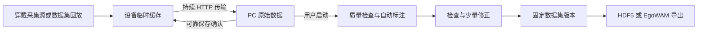

# CapEgo

**从第一视角采集，到来源可追溯的训练数据。**

[English](README.md) · [简体中文](README.zh-CN.md)

[](https://github.com/Auromix/capego/actions/workflows/tests.yml)
[](LICENSE)
[](pyproject.toml)

CapEgo 是面向开发者与研究者的开源 **ego 第一视角数据采集与数据集工具链**。围绕人自然使用双手操作的场景，将采集内容持续传到 PC，由使用者启动本地后处理、检查自动标注，再生成能够追溯来源的数据集，接入世界动作模型（WAM）训练。

**当前状态：可运行的软件原型。** 真实公开 EgoDex 片段已通过 HTTP 采集链路、EgoWAM 原版 Human loader 和缩小配置的世界／动作联合训练。实体穿戴设备和生产采集性能仍待开发验证。[查看证据和适用边界 →](design/validation/2026-09-24-real-data.md)

## 能解决什么？

- **持续传输和保存：** 边采边传，PC 可靠保存确认后才释放设备临时缓存；断连恢复后补传，不重新起录。
- **本地主动处理：** 数据到达不会触发后处理；使用者选择已结束、完整校验的采集后启动，接收服务与后处理可独立运行。
- **自动标注、人工检查：** 支持本地 VLM 语义建议和公开数据自带标注，保留不确定性及人工修订版本。
- **可追溯的数据集：** 固定内容快照、哈希、源时间戳、有效性和来源。缺失几何不会被补成有效观测。
- **实际训练接入：** 原生 HDF5 与固定版本的 EgoWAM 导出，通过实际读取、损失、反向传播和参数更新检查。
- **便于扩展：** 采集来源、处理后端、导出器分别组织，无强制云服务依赖。



## 快速开始

需要 Python 3.11+。目前在 macOS 开发，CI 覆盖 Ubuntu 24.04 和 macOS。从仓库安装：

```bash
git clone https://github.com/Auromix/capego.git
cd capego
python3 -m venv .venv
source .venv/bin/activate
pip install -e '.[dev,export]'
python scripts/demo_pipeline.py --root runtime/demo --egowam
```

这是小规模的**合成数据**测试：自动启动接收服务，通过 HTTP 持续上传，运行后处理、保存数据集并导出，完成后关闭接收服务。交互使用时：

```bash
capego serve --root runtime/pc
# 另一个终端，启用同一虚拟环境：
capego simulate --seconds 5
```

访问 **http://localhost:8765**，选择完整采集、启动处理、检查标注、保存数据集版本并导出。`synthetic` 处理方式只适用于合成测试数据。

## 用真实 ego 数据验证

真实数据验证使用三段公开 EgoDex 操作视频，包括开盖、瓶盖操作和叠衣服。验证中会实际终止并重启接收进程，检查补传，并确认手部置信度缺失时拒绝输出有效训练样本。

```bash
pip install -e '.[data,export]'
python scripts/fetch_egodex_samples.py
python scripts/validate_real_pipeline.py --root runtime/real-validation
```

只下载所选 ZIP 成员，约 21 MB。验证脚本中的检查通过是隔离的流程测试，不代表人工认可标注准确性。EgoDex 数据采用独立的 **CC-BY-NC-ND** 条款，原数据和转换结果保留在本地。[数据适配、坐标约定和训练验证命令 →](docs/real-data.md)

## 已实现与待验证

| 部分 | 当前范围 |
| --- | --- |
| 采集与保存 | HTTP 持续上传、可靠确认、分块、补传、完整性校验；合成来源及 EgoDex 回放 |
| 后处理 | 曝光／时间检查、本地 Qwen2.5-VL 语义建议、导入 EgoDex 手部及相机估计 |
| 检查与治理 | 本地工作台、修订冲突检查、固定数据集版本与来源校验 |
| 数据导出 | 保持原始采样的 HDF5；固定 commit 的 EgoWAM Human Zarr 适配 |
| 训练验证 | 真实 RGB 与手腕／相机轨迹；CPU 上缩小 HPT 配置实际计算损失、反向传播及更新 |
| 待验证 | 实体相机和 IMU、硬同步、持续双目带宽、新 RGB 的三维重建、物体跟踪、NVIDIA GPU、完整训练配置 |

真实数据只有**单路 RGB 和来源提供的几何估计**，没有伪造第二路画面或 IMU。训练验证确认数据被用上，不代表模型效果。当前传输协议采用逐帧 JPEG/PNG，尚未实现生产级 H.265/AV1 采集。

## 文档与贡献

- [运行与局域网部署](docs/usage.md)
- [真实数据与 EgoWAM 验证](docs/real-data.md)
- [模块结构和扩展方法](docs/architecture.md)
- [产品与系统设计入口](design/README.md) — 主要设计文档使用中文
- [软件演示视频](design/validation/video-demo.md) — 早期合成数据工作台演示
- [贡献指南](CONTRIBUTING.md) · [更新记录](CHANGELOG.md) · [安全说明](SECURITY.md)

欢迎通过 [Issues](https://github.com/Auromix/capego/issues) 或小范围 PR 参与相机接入、质量检查、几何模型、数据适配和可复现硬件测量。提交结果时请说明数据来源、验证方法和限制。

## 许可证

CapEgo 代码与原创文档采用 **[Apache License 2.0](LICENSE)**。外部数据集、模型权重和上游工程保留各自许可，见 [THIRD_PARTY.md](THIRD_PARTY.md)。仓库不包含外部数据集或模型权重。
