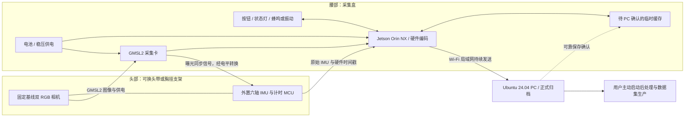

# CapEgo 硬件参考设计提案

> 2026-09-24 · **待用户确认**。这是架构与首台样机建议，不是已冻结规格、采购清单或验证结果。依据见[市场调研](market-survey.md)。已确认的产品行为仍以[产品范围](../product/scope.md)与[总体架构](../system/overview.md)为准。

## 推荐决定

采用**头戴双目传感器 + 腰部采集盒与电池 + 局域网 Ubuntu PC**。首台优先用 ZED X Mini 广角版和 Jetson Orin NX 8 GB 建立工程基准，再根据实测决定是否开发低成本 AR0234/RK3588 版本。

首版头戴优先、胸戴作为同一采集头的可换支架。头戴有利于视角随观察目标移动；胸戴减少头部负担，但可能被手臂或桌沿挡住。二者都是设计假设，应通过同任务对照选定默认支架。首版不要求手套、眼动、控制器或身体动捕。

这次建议批准的是**架构、首台验证路线与预算级别**。镜头视场口径和同步合格标准需一并确认；具体采购订单要在配件兼容核对完成后形成。

## 物理组成

上图表示职责和连接方向，不是可直接焊接的原理图。工程机的头腰线束包含 GMSL 同轴线及同步/遥测连接，不能宣传成“一根普通 USB 线”。线束沿肩背固定、接口卸力；计算盒散热面朝外，电池独立固定，禁止把裸板或散热片直接贴皮肤。

## 建议规格及其状态

| 项目 | 首台建议 | 依据或待验证内容 |
| --- | --- | --- |
| 相机 | ZED X Mini 2.2 mm 广角、无偏振片，SKU ZED-311210 | 厂商型号；无偏振片作为室内默认提案，减少不必要进光损失 |
| 双目布局 | 固定 50 mm 基线，左右 RGB 平行布局 | 采用模组原有几何；不拆镜头、不改基线 |
| 采集档位 | 每路 1920×1200@30 FPS 为默认；60 FPS 为验收后的快速动作档 | 相机支持不代表整条链路已通过 |
| 快门 | 全局快门，左右匹配曝光；关闭电子防抖和动态裁剪 | 保留稳定几何，记录曝光、增益及 ISP 配置 |
| 视场 | 首台采用 H110°/V80°/D120° | **需明确接受对角 120°**；若要求水平 ≥120°，本模组不符合，应换镜头路线 |
| 佩戴角度 | 向下可调 0°–30°，先比较 0°/15°/30° | 测试不同身高、坐姿/站姿与操作距离；不是已证实最佳角度 |
| 工作距离 | 优先验证镜头到操作区域 0.3–1.0 m | 不把厂商深度范围当作双手跟踪保证 |
| IMU | 外置 ICM-42688-P，目标加速度与陀螺仪原生 1 kHz；内置 IMU 保留作对照 | 外置 IMU 与相机刚性连接；读取原始样本和时间，不只取每帧最近一条 |
| 左右曝光误差 | 提议 ≤0.2 ms，测试中报告 p95、p99 和最大值 | 这是整机验收目标，不引用多相机同步指标替代左右实测 |
| 视频—IMU时间误差 | 提议 p99 ≤1 ms，测试内最大值 ≤2 ms | 指校正后采样时间关系误差；不是网络延迟，也不是最近样本距离 |
| 编码 | H.265 优先，H.264 作为兼容档；首版不要求 AV1 | 按实际 NVENC 路径验收，不能把支持 AV1 解码当作编码能力 |
| 本地介质 | 128/256 GB NVMe，初始给 outbox 16 GB 逻辑配额并另留收尾空间 | 介质还装系统，不把全部容量当离线录制空间；满则异常结束 |
| 联网 | 5 GHz Wi-Fi 6；PC 用千兆有线接 AP | 实测有效吞吐、断连补传、人体遮挡与拥塞；不按标称 Wi-Fi 速率验收 |
| 操作 | 一个录制启停按钮，明确录制/补传/异常反馈 | 无屏幕依赖；用户无需现场分任务 |
| 供电 | 腰部 60–75 Wh 成品电池，稳压到载板所需电压；峰值供电能力预留 ≥60 W | Wh 为容量、W 为输出能力；接头、电压和启动峰值逐项验证 |
| 重量 | 工程机头部组件目标 ≤250 g；后续定制版目标 ≤150 g | 相机本身 151 g，因此不能声称现成 Mini 整机可做到 150 g |
| 续航 | 工程机目标 ≥2 h；不承诺热插拔 | 75 Wh、85%可用效率、整机 30 W 时约 2.1 h，仅预算推算 |

相机的分辨率、基线、FOV、重量和 SKU 来源：[厂商规格](https://docs.stereolabs.com/docs/products/cameras/zedx/specifications)。IMU 模式与时间寄存器需按 [TDK 数据手册](https://product.tdk.com/system/files/dam/doc/product/sensor/mortion-inertial/imu/data_sheet/ds-000347-icm-42688-p-v1.6.pdf)实现。其余未注明厂商事实的数值均为本提案目标或估算。

FOV 不仅看一个角度：原始视场、左右共同覆盖区、矫正后裁剪和最终训练裁剪都需要记录。若手从训练裁剪范围消失，即使原始镜头达到 120° 也不能视为采集合格。首版不为追求 150° 自动牺牲手部像素密度和边缘成像。

## 同步链路：最需要做实的部分

### 为什么增加一套外置 IMU

内置 IMU 的 200 Hz 输出本身不是错误，但“每帧取最近样本”不足以证明 1–2 ms 时间精度。为使同步路径可检查、可复现，建议用独立 MCU 同时观察曝光信号和 IMU 采样事件；内置 IMU 作为诊断对照，不拼接成一个看似更高频的流。

### 工程实现建议

1. **时基**：头部 MCU 使用硬件计数器捕获曝光同步边沿与 IMU DRDY，不用 Linux 收包时间或普通软件中断进入时刻充当采样时刻。STM32G4 类开发板作为原型候选，例如 [NUCLEO-G431KB](https://www.st.com/en/evaluation-tools/nucleo-g431kb.html)。完成引脚分配后才确定具体板卡。
2. **曝光事件**：ZED Link Mono TRIG_OUT 位于腰部，通过电平转换与适合线束长度的信号驱动送到头部。厂商定义其上升沿为曝光结束；保存该语义，若下游使用曝光中点，则结合逐帧曝光时长换算。信号幅度 3.75 V ±12%，不得直接假设所有 MCU/IMU 输入都耐受。[接口定义](https://docs.stereolabs.com/docs/products/embedded/zed-link-capture-card/gmsl2/zed-link-mono/zed-link-mono-gpio-triggering)
3. **IMU**：MCU 用短距离 SPI 读取头部 IMU FIFO，记录原生计数、采样配置、温度、溢出与有效性。FSYNC、内部时间戳与 DRDY 的关系按寄存器模式验证；FSYNC 标记不等于强制六轴在视频曝光中点同时采样。测量并记录数字滤波延迟。
4. **帧关联**：保持曝光事件号、驱动帧号与编码后帧号的关联。启动、丢帧、重连、重复帧均不得简单把第 N 个脉冲硬配第 N 帧。先验证驱动是否提供足够元数据；不足时需加入可观测时码测试和重新锚定机制。映射不确定的区间标为无效，不能标同步通过。
5. **时间导出**：保留原始曝光/IMU时间及到单次采集时间轴的映射。编码 PTS、PC接收时间另存，跨块不重置；导出才按模型需要插值，保留插值与缺失标记。

该设计增加了同步线束和固件工作量，但把最关键的时间误差变成可以测量的对象。**若信号与真实曝光的对应、丢帧后映射或 IMU 时刻不可可靠验证，该配置不得以“满足 1–2 ms”发布。**不能靠后处理把时间戳改成相同值来通过测试。

## 采集盒与系统环境

首台建议 Orin NX 8 GB，配厂商明确支持的载板和 ZED Link Mono。NX 的选择主要为了相机链路和硬件编码，而非在佩戴设备上运行 VLM。[NVIDIA Orin 产品规格](https://www.nvidia.com/en-us/autonomous-machines/embedded-systems/jetson-orin/)

不把 Orin Nano 当成便宜的等价编码方案：NVIDIA 明确说明其没有 NVENC。[官方说明](https://docs.nvidia.com/jetson/archives/r36.5/DeveloperGuide/SD/Multimedia/SoftwareEncodeInOrinNano.html)

ZED X 不能通过普通 GMSL2 转 USB3 转换器直接替代配套链路；它使用 Jetson ISP。[厂商说明](https://support.stereolabs.com/articles/2126344525-can-i-connect-the-zed-x-and-zed-x-mini-to-a-usb3-port)

接收 PC 继续使用 Ubuntu 24.04。采集盒则固定一组厂商支持的 JetPack、相机驱动与 SDK 镜像，不为了统一版本而强制刷成 Ubuntu 24.04。版本组合是样机前核对项；目前没有把任何组合描述为已验证。

PC 起步建议现有 x86 工作站、32 GB 内存、独立 1–2 TB SSD 和千兆网口；这是资源建议，不是软件最低要求。接收无需 GPU，后处理和训练继续参考用户的 RTX 5880 48 GB 单卡预算。首次安装后缓存依赖和标定，并实测断互联网运行。

## 吞吐、存储与临时缓存

以下按十进制 Mbps/GB 计算，是设计预算，不是已经测得的码率。

| 模式 | 双路合计规划码率 | 每小时视频约占用 | 说明 |
| --- | --- | --- | --- |
| 1200p30 | 30–50 Mbps | 13.5–22.5 GB | 从每路 15–25 Mbps 起测，按手部纹理和运动质量调整 |
| 1200p60 | 50–80 Mbps | 22.5–36 GB | 从每路 25–40 Mbps 起测，仍须测峰值和重编码损失 |
| RAW10 / 1200p30 | 1.3824 Gbps | 622 GB | 未计传输协议、对齐和元数据；不是默认 Wi-Fi 模式 |

视频容量公式：`GB/h = Mbps × 0.45`。双目 RAW10：`2 × 1920 × 1200 × 30 × 10 bit/s`。生产接收能力应覆盖编码峰值、补传和校验开销；AP 到采集盒的实测持续有效吞吐建议至少为目标峰值的 3 倍。

16 GB 缓存在 80 Mbps 下理论约 26.7 分钟；不能把它宣传为保证断网续录时长。文件元数据、磁盘空间、峰值码率和收尾保留区会减少可用时间。建议先把“10 分钟断连后可完整补传”作为压力场景，正常链路仍是持续发送、持续释放。

PC 保存确认必须沿用已确认的可靠落盘语义。网络恢复后同时处理新数据和积压；补传带宽不足时缓存会继续增长，达到边界按既定规则结束，不覆盖、不静默降质、不自动续录。

### 视频文件与当前代码的衔接

建议每路 RGB 使用短 GOP 的 H.265/fMP4，1 秒左右独立可解码片段作为传输候选，PC 按同一次录制目录建立索引；IMU 和逐帧元数据可采用 MCAP，标定与设备信息采用 JSON。时长与容器是后续性能实测可调整的实现参数。

保存相机原生视图，不在归档前做电子防抖、动态裁剪或不可逆双目矫正；ISP和有损压缩仍然存在，因此“原始采集数据”不应宣传为“无损 RAW”。短样本额外保留未压缩图像用于评估压缩对标注的影响。训练格式独立导出，不为每个模型重新录制。

现有软件以逐帧 JPEG/PNG 数据走通协议与训练链路，**H.265分片、驱动帧元数据和MCAP并未因这份提案而实现**。需要相机适配器、编码分片适配、时间映射和相同 ACK/完整性语义的接入工作，不能仅运行厂商 RTSP 服务就视为可靠归档完成。

## 机械、散热与供电预算

- 头部固定相机、IMU和小型计时板；三者共用刚性安装面，软头带在刚体之外。支架有角度刻度、机械限位、镜头保护与线缆卸力。装卸、碰撞或镜头变化后检查标定。
- 工程机头部重量目标 250 g 内，包含头带、接头、同步板与线缆承重部分。若实际超限，先报告再决定是否拆壳或更换相机；不把裸模组重量当佩戴重量。
- 腰部盒子预留主动散热。先按 20–30 W 整机平均功耗估算，仍须测启动与 Wi-Fi/SSD/编码同时工作时的峰值；不在散热片未验证时承诺密闭防水。
- 75 Wh 电池、85%可用效率时，20 W 约3.2 h、30 W 约2.1 h。选成熟成品电池与匹配稳压模块，首版不自制电芯包。USB-PD、电压转换和插头必须验证，不能拿任意“快充充电宝”替代稳压供电。
- 按钮结束后维持供电，直到状态显示补传完成；低电量提前结束并留出收尾余量。突然断电的尾块损坏边界必须实测，不能宣称零丢失。首版无无缝换电承诺。

## 首台预算

以下均为**人民币工程预算区间**，不是已获得的供应商报价，也不是美元实时换算。含常规配件预留，不含接收 PC、GPU、研发工时、税运差异和专业测试仪器；不得据此直接下单。

| 组成 | 预算区间 | 采购与兼容条件 |
| --- | --- | --- |
| ZED X Mini 广角相机 | ¥4,000–5,500 | 官方相机起价 $549；确认国内渠道、镜头和附件 |
| Orin NX 8 GB、兼容载板、ZED Link、散热与必要 GMSL 线缆 | ¥4,000–7,000 | 整套核价；已集成采集卡的方案不能重复计价 |
| 外置 IMU、MCU、电平转换、同步/遥测线束 | ¥300–800 | 暂为开发板装配，需确认引脚和板卡尺寸 |
| NVMe、Wi-Fi 模块及天线 | ¥400–800 | 核对载板接口、Linux驱动和供电峰值 |
| 电池、稳压与线缆 | ¥400–900 | 峰值能力与安全固定方式需实测 |
| 头带、支架、腰盒、按钮与反馈器件 | ¥300–800 | 3D打印和小批量加工估算 |
| 小计 | **¥9,400–15,800** | 建议首台预算按 **¥1.1万–1.8万** 留出返工余量 |

如果用户希望社区完整套件必须低于 ¥3,000–5,000，应调整研发优先级，优先验证低成本相机/RK3588路线；不能把工程参考机预算硬压到该区间。该成本目标尚无闭环 BOM 支撑，不承诺可达。首台也可以先借用 Jetson 和相机，减少试错采购。

## 验证计划与退出条件

所有阈值为建议，批准后形成正式验收矩阵。现在不把任何一项标为通过。

| 阶段 | 怎样测试 | 通过条件或下一步 |
| --- | --- | --- |
| 配件与权限 | 核对镜头SKU、载板、采集卡、驱动版本、同步输出、离线标定；取得原始帧与全部 IMU 样本 | 任一关键字段/同步路径不可获取，先更换方案，不先量产外壳 |
| 台架采集 | 双路1200p30连续2h，另测60FPS；记录帧号、曝光、编码PTS、温度和耗电 | 无未解释丢帧/重复帧；缺失均可检测；时间轴跨块连续 |
| 曝光与时间 | 示波器/逻辑分析仪测信号；光学LED时码测左右曝光；运动标定复核相机-IMU偏移 | 分别报告左右误差和相机-IMU误差；固定偏差、漂移、p99和最大值不混写；测量精度至少优于门槛一个数量级 |
| 同步故障 | 故意丢帧、重启流、改变曝光；比较视频帧与脉冲序列 | 不产生持续错一帧；映射不明时标无效并报错。仅凭 Kalibr 残差不能证明最大误差合格 |
| 网络/存储 | Wi-Fi遮挡与拥塞；断连60s/10min；接收进程退出；PC盘满；受控缩小缓存制造耗尽 | 严格符合既定保存、补传、异常结束和不自动续录规则；PC归档摘要一致 |
| 供电/散热 | 电池低电量、启动峰值、断电；室内正常温度及35°C测试环境分别测 | 报告热降频、续航、贴身面温度及尾块损失；不能把厂商芯片工作温度当佩戴舒适标准 |
| 佩戴/覆盖 | 至少5人，坐姿/站姿，0.3–1m，拿取、开盒、倒物、双手传递；比较头戴/胸戴与俯角 | 建议在实际需要双手的操作时段，双手及交互物体同时进入可用画面的抽查比例≥95%；分别记录遮挡、模糊和佩戴不适 |
| 标定/几何 | 棋盘格或AprilGrid覆盖全视场、不同距离；独立验证集；静止IMU、相机-IMU外参 | 保留内参、畸变、双目/IMU外参、噪声、时间偏差与版本；先建议重投影RMS≤0.5px，边缘误差另报 |
| 数据可用性 | 实体采集10–20段任务 → PC归档 → 人工启动自动处理 → 检查 → 固定数据集 → 既有目标WAM loader/最小训练 | 使用真实双目与IMU，不伪造几何；披露有效手部轨迹比例与缺失，完成有限loss/反传检查；不要求论文效果 |

佩戴阶段是实用性验证，不用算法“检测到至少一只手”的比例替代双手共同可见比例。三维手部与位姿精度需要单独评估；视频清晰和网络畅通不足以证明训练数据已经合格。

## 开源交付与后续优化

首台验证后应公开可编辑支架CAD、装配图、精确BOM及替代件规则、同步接线与固件、系统镜像构建/安装方法、标定工具、设备适配器、测试脚本和匿名示例结果。第三方软件保持原许可，不能承诺把其固件或 SDK 全部开源。

低成本版复用同一数据与同步契约，更换为经验证的双 AR0234 模组和 RK3588 编码主板。采用原始 Bayer 输出时必须补齐 ISP；采用模组板载 ISP 时必须取得曝光、帧号和同步信号。不能用超长裸 MIPI 软排线穿过头腰连接，也不能因标有“USB相机”就假定有曝光级硬件时间戳。

只有工程参考机证明现有视场、帧率与数据能用于既有训练入口，且成本或重量确实妨碍社区复现时，再投入定制板和轻量结构。最终需要用户确认的核心取舍是：**是否接受首台采用可采购商用双目模块、约1.1万–1.8万元工程预算，以及对角120°视场，换取更快建立真实数据基准。**
