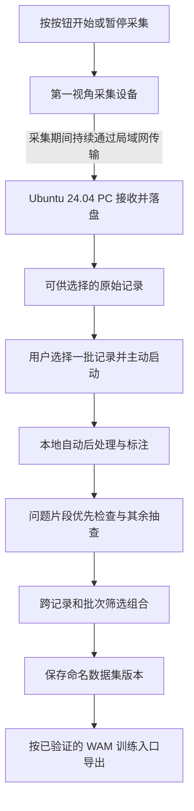

# 完整使用流程

本页展开[已确认产品定义](scope.md)中的个人使用流程，描述用户行为和结果，不规定服务拆分、通信协议或界面技术。

## 用户旅程

| 阶段 | 用户做什么 | 系统应完成什么 |
| --- | --- | --- |
| 首次准备 | 按开源文档准备参考设备、本地软件、模型和依赖 | 提供后续无互联网依赖的使用条件；具体准备步骤待设计 |
| 准备采集 | 使采集设备与 Ubuntu 24.04 接收 PC 位于同一局域网 | 建立可持续接收和落盘的工作条件；连接与状态确认方式待设计 |
| 持续采集 | 按按钮开始，自然进行桌面物体操作，按按钮暂停 | 采集期间持续向接收 PC 传输并保存原始记录；任务与片段留给后处理识别 |
| 发起处理 | 在可视化工作台中选择一批记录并启动完整流程 | 为这次明确选择的批次执行后处理；新到达数据继续等待用户发起处理 |
| 自动处理 | 查看处理状态，等待结果 | 自动完成任务识别、片段划分、手部动作提取、相关标注和质量检查 |
| 检查结果 | 优先检查问题片段，抽查其他结果，少量纠正或补充 | 提供视频与结果的对照检查，保留自动检查结果和人工复核记录 |
| 生产数据集 | 跨记录与处理批次筛选、组合，保存命名版本 | 保存可以重复导出相同内容的数据集版本 |
| 导出与使用 | 选择已支持的训练目标并导出，在目标工程中使用 | 按具名训练仓库和版本的要求交付数据及使用说明，提供相应训练接入验证证据 |

## 从连续记录到训练数据

图中前半段描述持续采集与保存，后半段描述用户启动的数据处理流程。一段连续记录可以包含多个任务，后处理生成的任务片段不由按钮暂停直接定义。

工作台需要让用户理解记录和数据集当前处于哪个环节。采集与传输提示、处理状态、问题定位和导出结果的具体呈现，后续逐段设计。

## 下一步需要明确的正常与异常行为

- 用户怎样得知接收 PC 正在接收、数据已保存，以及采集或保存发生问题。
- 局域网中断、接收 PC 不可用或存储不足时，如何提示和处理已采集及尚未保存的数据。
- 哪些记录可以进入处理批次；正在采集、正在保存和正在处理的数据之间如何协调。
- 后处理失败或部分片段不可用时，怎样定位、重新处理和保留已有检查结果。
- 人工修改结果怎样反映到后续数据集版本，同时保证已有版本可重复导出。

以上是系统设计需要解决的问题，目前尚未确定重试、缓存、并发、保留和清理策略。
