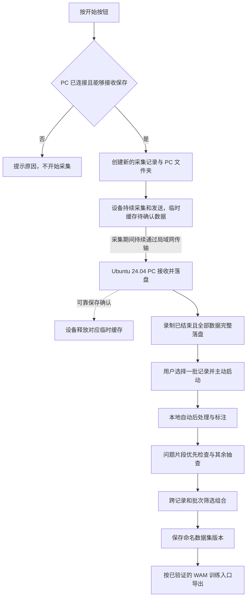

# 完整使用流程

本页展开[已确认产品定义](scope.md)中的个人使用流程，描述用户行为和结果，不规定服务拆分、通信协议或界面技术。

## 用户旅程

| 阶段 | 用户做什么 | 系统应完成什么 |
| --- | --- | --- |
| 首次准备 | 准备采集设备和配备本地 GPU 的 Ubuntu 24.04 PC，下载软件、模型与依赖 | PC 提供接收、后处理和工作台；准备后无互联网依赖，具体配置和安装步骤待设计 |
| 准备采集 | 使采集设备与 Ubuntu 24.04 接收 PC 位于同一局域网 | 起录前确认 PC 已连接且能够接收保存；具体检查与状态提示方式待设计 |
| 持续采集 | 按开始，自然操作，完成后按结束 | 起录条件满足后新建采集记录及 PC 文件夹，边采边传、PC 持续分块落盘；设备临时缓存随保存确认释放；起录条件不满足则提示原因、不开始采集 |
| 等待保存完成 | 查看记录的传输和保存状态 | 结束录制后继续传输，全部数据在 PC 落盘并校验完整后才允许选入处理 |
| 发起处理 | 选择一条或多条完整记录，按需补充背景提示，启动完整流程 | 各记录独立处理；新到达数据等待人工启动，不与采集接收联动 |
| 自动处理 | 查看处理状态，等待结果 | 自动完成任务识别、片段划分、手部动作提取、相关标注和质量检查 |
| 检查结果 | 优先问题片段、其余抽查；修改描述或边界，标记可用或排除 | 分别保存自动质检和人工检查状态，修正绑定对应处理版本 |
| 生产数据集 | 跨记录与处理批次筛选、组合，生成命名版本 | 固定片段、处理版本、当时标注及检查结果；未解决问题或已排除片段默认不纳入 |
| 导出与使用 | 选择已支持的训练目标并导出，在目标工程中使用 | 按具名训练仓库和版本的要求交付数据及使用说明，提供相应训练接入验证证据 |

## 从连续记录到训练数据

图中前半段描述持续采集与保存，后半段描述用户启动的数据处理流程。录制期间始终边采边传，PC 持续接收和落盘；设备缓存是传输过程中的临时缓冲，随 PC 的可靠保存确认持续释放。录制途中断连时保留待确认数据，恢复后自动补传。

首版只有满足[开始录制的条件](../system/overview.md#开始录制的条件)才能起录，不支持未连接 PC 时仅用设备缓存开始新录制。一次录制可包含多个任务，任务和操作由后处理识别，不由存储块边界定义。结束录制固定本次内容范围，剩余未确认保存的数据仍继续传输。

缓存耗尽属于异常，直接结束本次录制并提示原因。已有数据继续保留，恢复连接后仍可自动补传；系统不自动续录或开启新的录制。补传与完整性校验通过前，不能将异常结束的记录视为已完整保存。

采集接收与历史记录的后处理可以同时独立运行。处理批次中某条采集失败，可单独重试；重新处理生成新版本并保留旧结果。自动质检通过的片段可纳入数据集，无需逐条人工确认，但必须保留未人工检查的状态。详细规则见[系统设计](../system/overview.md)和[处理与数据集设计](../data/processing.md)。

工作台需要让用户理解记录和数据集当前处于哪个环节。采集与传输提示、处理状态、问题定位和导出结果的具体呈现，后续逐段设计。

## 下一步需要明确的正常与异常行为

- 用户怎样得知接收 PC 正在接收、数据已保存，以及采集或保存发生问题。
- 局域网中断、接收 PC 不可用或存储不足时，如何提示和处理已采集及尚未保存的数据。
- 处理阶段失败后怎样展示问题、选择重试范围和复用中间结果。
- 人工修正历史、数据集引用保护和旧结果清理怎样实现。

缓存补传、独立处理、版本保留与数据集固定的行为已确认；具体恢复、调度、存储和清理机制仍待设计。
