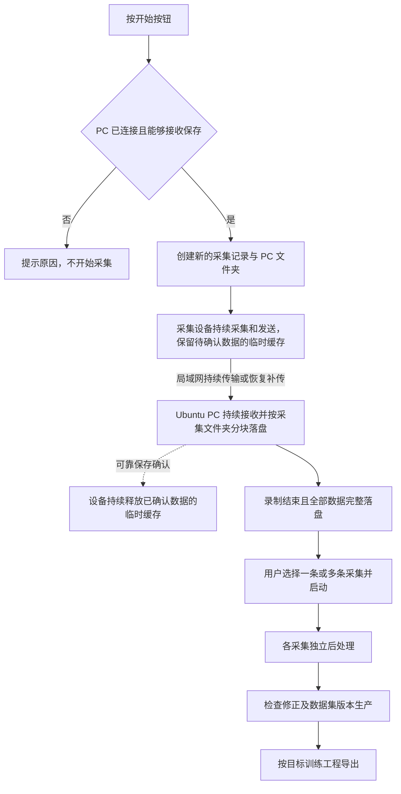

# 总体架构与采集保存

> 状态：本页记录截至 2026-09-24 逐项讨论确认的设计行为。尚未实现或验证；进程、接口、协议、器件和量化指标仍待设计。

## 首版部署与职责

首版采用一台头戴或胸戴采集设备，加一台同一局域网中的 Ubuntu 24.04 PC。该 PC 同时承担接收存储、后处理、数据集管理和可视化工作台。完整后处理以配备本地 GPU 的 PC 为参考环境；接收与保存本身不依赖 GPU。具体 GPU、显存及整机配置在处理模型和性能要求明确后选择。

以下是逻辑职责，不表示必须拆成五个进程或服务。

| 部分 | 职责 | 首版位置 |
| --- | --- | --- |
| 采集端 | 按钮开始和结束录制，采集图像与 IMU，持续发送，临时缓存待确认保存的数据并按需补传 | 佩戴设备 |
| 接收与存储 | 持续接收、落盘、检查完整性，记录保存状态及异常 | Ubuntu PC |
| 后处理 | 用户启动后自动生成片段、双手运动、操作语义和质量结果 | 同一台 PC |
| 数据集管理与导出 | 管理检查修正、筛选组合、固定数据集版本，并按训练目标导出 | 同一台 PC |
| 可视化工作台 | 提供状态查看、处理启动、检查修正和数据集操作入口 | 同一台 PC |

采集接收与后处理独立运行，可以同时运行。后处理只读取已经结束录制且完整落盘的采集记录；开始、停止其中一项，不要求联动另一项。资源预算和并发控制仍待性能设计，不将“采集期间禁止后处理”或“采集一开始就暂停后处理”作为产品规则。

职责保持清晰，以便未来拆分存储与计算；跨机器计算部署不属于已经确定的首版拓扑。首次下载软件、依赖和模型允许联网，准备完成后的运行不依赖互联网。

## 开始录制的条件

首版开始录制前，必须确认采集设备已连接到接收 PC，且 PC 能够接收并保存数据。仅处于同一局域网或能够访问 PC，不足以判定已具备保存条件。

用户按开始后，满足上述条件才开始新的录制；条件不满足时不开始采集，并提示未能开始的原因。首版不支持在 PC 未连接或不能保存时，仅依靠设备缓存开始新录制。连接、接收与保存能力的检查方法、超时、容量判断和提示方式仍待设计；开始时检查通过不代表保证后续始终可写。

这一条件只约束开始新录制。录制已经开始后，网络中断或 PC 暂时无法接收，仍按下述缓存与补传规则处理。

## 一次录制对应一个文件夹

按开始且满足[开始录制的条件](#开始录制的条件)后，创建一次新的采集记录，在 PC 上建立其独立文件夹。PC 持续接收数据并按固定时长分块保存。按结束停止产生新数据，封闭最后一个数据块，本次录制的内容范围固定。再次开始创建新的记录和文件夹，不恢复到上一条记录中。

```text
采集记录/
├── 采集 A/
│   ├── 采集信息与分块索引
│   ├── 数据块 001
│   ├── 数据块 002
│   └── …
└── 采集 B/
    └── …
```

此处表示 PC 上的采集数据组织关系，尚未确定实际目录名、文件名、格式或分块时长。设备临时缓存中的数据如何关联对应采集及 PC 保存位置，仍待详细设计。

分块是存储实现，不是任务或动作划分。读取层按原始时间关系拼接同一次采集的块，对后处理提供统一时间线，同时保留断流、缺帧等信息。任务或操作可以跨存储块边界。多次采集可同时进入后处理批次，但不能因批量处理而丢失各自的边界和来源。

## 持续传输、设备临时缓存与补传

正常录制时，采集、局域网传输和 PC 落盘持续并行进行，数据随采集持续送往 PC。PC 是原始采集数据的正式保存位置；设备上的缓存仅用于暂存尚未获得 PC 可靠保存确认的数据，已确认部分在录制过程中持续释放。

临时缓存用于承接传输与保存的短暂积压，并支持断连后的补传，不承担整次录制的归档。传输不等待缓存积满或录制结束，PC 的存储分块也不改变边采边传的主流程。

正常采集按缓存不会耗尽的容量与传输能力目标设计。缓存满属于异常，发生时直接结束本次录制。

| 情况 | 已确认行为 |
| --- | --- |
| 正常录制 | 边采集、边持续传输到 PC 落盘；临时缓存中已获可靠保存确认的数据持续释放 |
| 录制途中网络中断或 PC 暂时无法接收 | 未确认保存的数据保留在设备临时缓存中，新采集数据也暂存其中 |
| 连接恢复 | 自动补传未完成的数据 |
| PC 确认数据可靠保存 | 设备释放对应临时缓存；仅发送成功或 PC 收到数据不足以释放 |
| 缓存将满 | 明确提示用户 |
| 缓存耗尽（异常） | 停止产生新数据，异常结束本次录制，记录并提示原因；保留已有数据，不覆盖尚未可靠保存的数据 |
| 用户结束录制 | 停止采集新数据，已有数据继续传输或补传 |

缓存耗尽导致录制异常结束后，连接恢复仍自动补传已有数据，但不恢复本次录制，也不自动创建新的录制。

缓存容量和介质、传输能力预算、可靠保存的确认条件、断点与重复传输处理、补传顺序、设备或 PC 意外断电恢复均待详细设计。正常运行下缓存不耗尽是设计目标，容量与吞吐尚未实测验证。

## 录制结束与数据完成分开表示

一次录制正常结束或因缓存耗尽异常结束后，不再添加新的采集内容，但设备可能仍有待补传数据。因此“录制已结束”和“PC 上数据已完整落盘”不是同一个条件。异常结束需保留原因，已有数据是否完整由补传与校验结果判断。

只有同时满足以下条件，采集记录才可以进入后处理：

1. 录制已结束，不会继续添加采集内容。
2. 本次录制的全部数据已经传输到 PC 并落盘。
3. 完整性校验通过。

正在录制、等待补传或完整性校验未通过的记录可以查看状态，不能选入后处理。即使部分块已封闭，也不提前处理尚未完成的采集记录。传输完整性与内容质量分别判断：完整接收到的记录仍可能存在模糊、遮挡或跟踪失败等内容质量问题。

## 数据流与后续设计



后处理、检查和数据集版本的规则见[处理与数据集设计](../data/processing.md)。接下来仍需确定：

- 录制标识、时间戳、分块索引和完整性判断方法。
- 连接建立、起录条件检查、保存确认、缓存清理、断电恢复及异常提示。
- PC 磁盘不足、进程退出和同时处理负载下的资源边界。
- 采集硬件、同步机制、传输协议、容器格式和具体部署方式。
