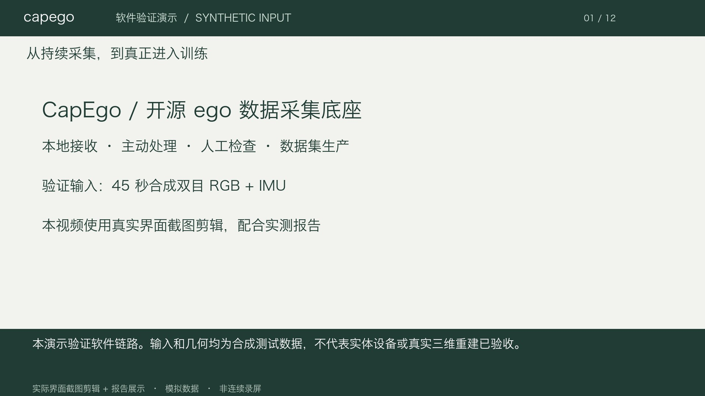

# 软件验证演示视频

日期：2026-09-24。视频对应软件原型，输入为模拟 ego 数据，未使用实体设备。

[播放／下载 MP4](media/capego-software-demo.mp4?raw=true) · [中文字幕](media/capego-software-demo.vtt) · [章节与视频摘要](media/capego-software-demo.json)

[](media/capego-software-demo.mp4?raw=true)

## 演示内容

连续传输并落盘 → 结束后完整校验 → 跨块统一读取 → 主动后处理 → 人工检查 →
不可变数据集快照 → HDF5/EgoWAM 导出 → 同一导出数据实际进入 EgoWAM 最小训练。

制作方式是**真实工作台截图剪辑、实测报告展示与本地合成中文解说**，不是连续录屏。
画面中的 synthetic 处理结果来自合成测试后端，不能当成真实 VLM 或三维重建结果。
视频也展示了一次真实 VLM 失败，不以合成结果替代失败的模型输出。

## 本轮证据

- 24 项 pytest 与 Ruff 通过。
- `film-capture`：45 秒、320×240 双路 RGB 10 Hz、IMU 50 Hz，共 3,150 包，9 个 5 秒块。
- 录制中观察：PC 已保存 1,790 包，处理任务数为 0；[当时的读数](media/source/during-capture.json)。
- 结束后校验完整，`resume` 再次验证保存状态，pending 与 cache_bytes 均为 0。
- 浏览器实际完成检查修订、数据集快照、两种导出，以及 44.900 秒双路图像读取。
- 同一个数据集 `dataset-76120e7664114b85bffc7447a3858215` 的导出参与官方固定版本
  EgoWAM CPU 训练；[训练报告](media/source/egowam.json)记录 source hash、loss 与参数张量更新数。
- [汇总证据](media/source/evidence.json)与原始界面截图一并保存，所有截图均为本地模拟数据。

训练是 60,780 参数的缩小配置，使用官方 Human loader、transform 和 HPT 世界/动作损失。
这证明数据参与训练，不证明论文配置、预训练权重、模型效果或单卡大模型训练预算。

## 仍待验证

45 秒录制的一次本地 Qwen VLM 尝试输出未完成 JSON，被契约检查拒绝并记录为失败。
此前的 2 秒样本运行成功，见[首轮验证](2026-09-24-software.md)。这次失败说明不能把
一次短样本成功概括为稳定自动标注；终止原因、长录制策略和语义准确度仍需排查。

云端 CUDA、真实传感器同步与吞吐、真实物体跟踪和三维手部/相机轨迹尚未通过验证。
云桌面防截屏使 Mac 侧不能读取终端；后续改为在云电脑内部安装 Codex，按
[接续说明](cloud-handoff.md)直接运行验证。视频不含云账号、云电脑 ID 或桌面私人内容。

## 复现视频文件

素材与解说：`media/storyboard.json`、`media/source/`。渲染只读取这些素材，不控制浏览器。
安装项目依赖后执行（将字体路径换成系统已有的中文字体）：

```bash
python scripts/render_validation_video.py \
  --manifest design/validation/media/storyboard.json \
  --font '/System/Library/Fonts/Hiragino Sans GB.ttc' \
  --output runtime/rebuilt-video/capego-software-demo.mp4 \
  --work runtime/rebuilt-video/work \
  --voice 'Tingting (中文（中国大陆）)'
```

`--voice` 使用 macOS 已安装的语音；Linux 或不需要语音时省略，仍会生成烧录中文字幕和 VTT。
系统字体与语音不随仓库发布。MP4 使用 H.264 / yuv420p；有语音时为 AAC。
